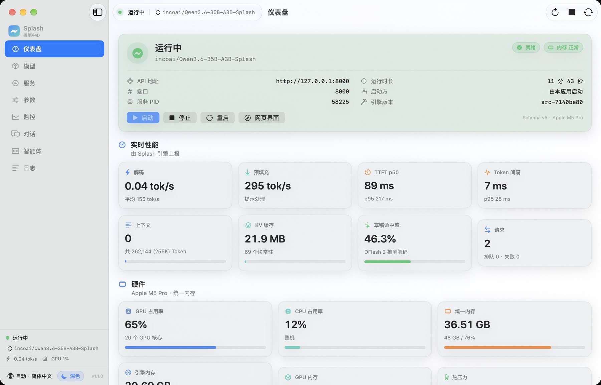
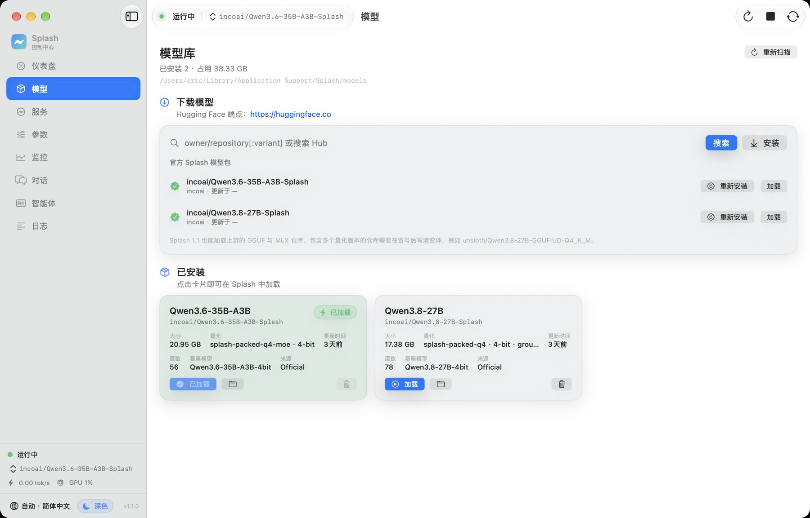
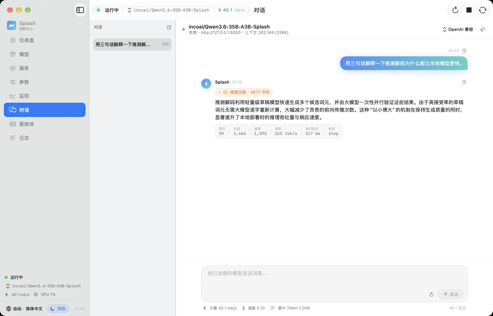
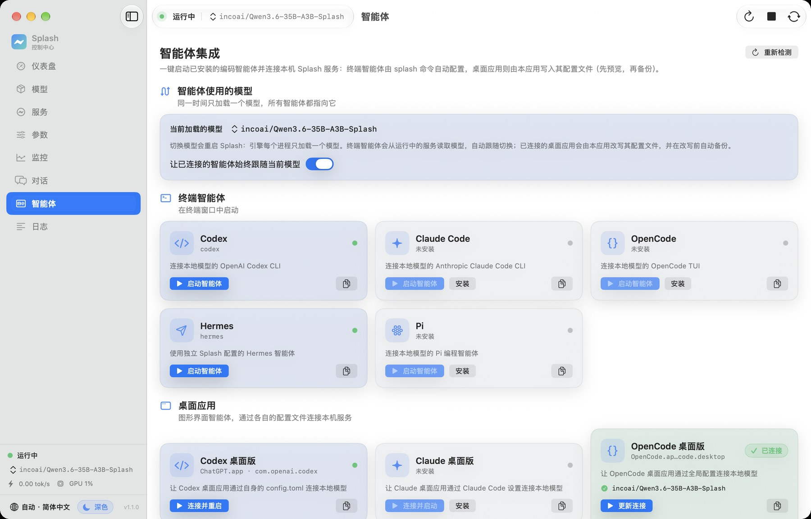
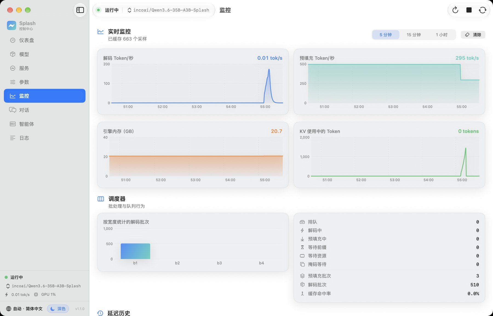
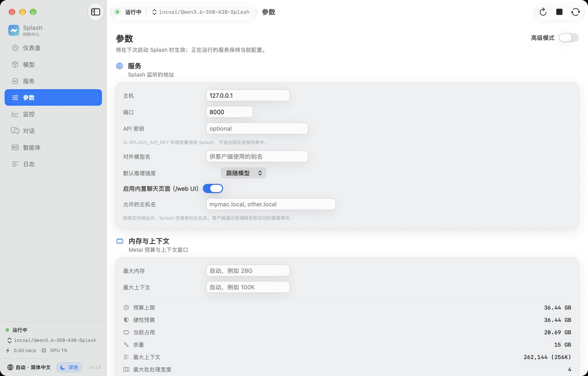
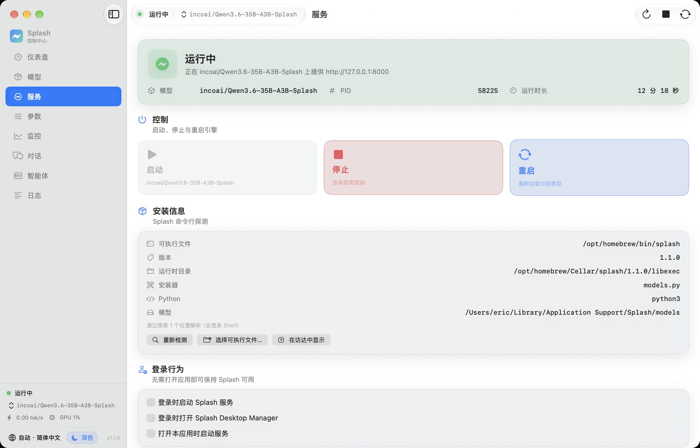

# Splash Desktop Manager

**A native macOS control centre for local LLM inference — no terminal required.**

Run the server · install and switch models · watch live performance · chat with the model · connect coding agents

[简体中文](README.md) · [English](README.en.md)

Splash Desktop Manager is the native macOS front end for the [Splash](https://github.com/incoai/splash) local
inference engine. Everything that normally needs a shell — starting the server, installing models, tuning
parameters, reading live telemetry, chatting, and connecting coding agents — lives in one window.

## Download

| Version | File | Size | Requirements |
| --- | --- | --- | --- |
| **1.1.0** | **[Splash-Desktop-Manager-1.1.0.dmg](https://github.com/ericlinclover-blip/Splash-Desktop-Manager/raw/main/Splash-Desktop-Manager-1.1.0.dmg)** | 2.9 MB | macOS 14+ / Apple silicon (M-series) |

This is the app itself; the engine and any model weights are installed on first run.

## Install

1. Download and open the `.dmg`
2. Drag **Splash Desktop Manager** into **Applications**
3. **Right-click the app → Open** the first time (the build is not notarised, so Gatekeeper asks once).
   Afterwards it launches normally.

## First run

A setup wizard replaces the empty dashboard: it checks the machine (macOS version, Apple silicon, unified
memory, free disk space), installs the `splash` CLI through Homebrew — streaming the output, cancellable —
and downloads a first model sized for your Mac. The wizard can be reopened at any time from
**Splash Desktop Manager ▸ Run Setup Again**.

## What it does

| Area | Capability |
| --- | --- |
| **Dashboard** | Server state and ownership, loaded model, API address and port, uptime, decode/prefill throughput, TTFT and inter-token percentiles, context and KV-cache usage, draft acceptance, request counters, CPU/GPU/unified-memory telemetry and live charts |
| **Models** | Installed inventory with on-disk size, quantisation and provenance; the official Splash catalogue; Hugging Face search; verified installs of Splash packages and upstream GGUF/MLX repositories; one-click switching; Trash-based deletion with reclaimed-space reporting |
| **Server** | Start / stop / restart, CLI discovery and version detection, login agent; servers started elsewhere are never killed silently |
| **Parameters** | Host, port, API key, served-model alias, reasoning effort, allowed hosts, max memory and context, KV format, SSD cache quota, upstream revision and draft model, request and image limits |
| **Monitor** | 5-minute to 1-hour rolling charts for decode/prefill throughput, engine memory, KV tokens, scheduler batch histogram and latency |
| **Chat** | Streaming chat against the running model with reasoning display, Markdown and syntax-highlighted code, per-message token statistics and a local SQLite history |
| **Agents** | Launch **Codex / Claude Code / OpenCode / Hermes / Pi**, and connect the desktop apps (ChatGPT, Claude, OpenCode, Hermes) to the same local server — configuration changes are previewed, backed up and reversible, and follow the loaded model |
| **Storage** | Hugging Face cache inventory, cleanup of orphaned blobs and interrupted downloads, sizes and clearing actions for history, logs and configuration backups |
| **Menu bar** | Live decode speed, model switching, start/stop and a shortcut to the dashboard |

| Models | Chat |
| :---: | :---: |
|  |  |
| **Agents** | **Monitor** |
|  |  |
| **Parameters** | **Server** |
|  |  |

## Notes

- This repository distributes the compiled app only — **no source code, no engine, no model weights**.
- The app is a management front end for Splash; the engine's licence and terms are those of Inco AI.
- Provided as-is, free to download and use.

Questions and feedback: [Issues](https://github.com/ericlinclover-blip/Splash-Desktop-Manager/issues).
