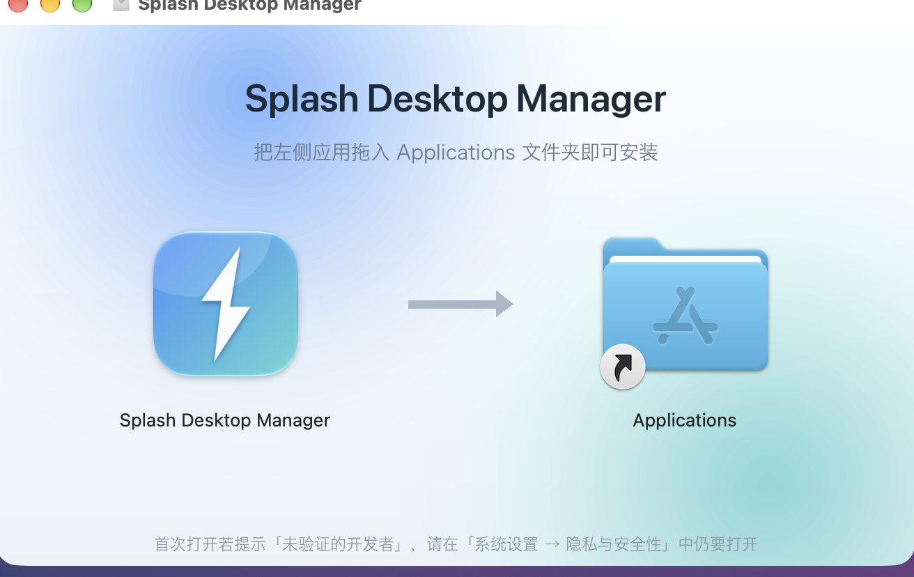
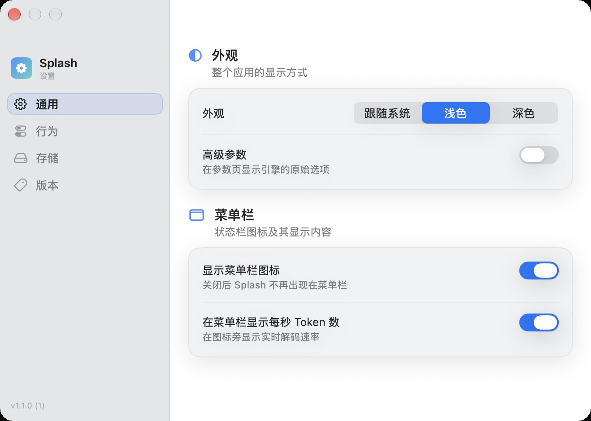

# Splash Desktop Manager

**macOS 上的本地大模型控制台 —— 不碰终端，也能把 Splash 跑得明明白白。**

启动推理服务 · 下载与管理模型 · 实时性能监控 · 内置对话 · 一键接入编程智能体

[简体中文](README.md) · [English](README.en.md)

Splash Desktop Manager 是 [Splash](https://github.com/incoai/splash) 本地推理引擎的原生 macOS 图形界面。
它把「命令行里才能做的事」——启停服务、装模型、调参数、看性能、开对话、接智能体——装进一个窗口里，
让第一次接触本地大模型的人也能几分钟内跑起来，让老手不再记命令。

---

## 📦 下载

| 版本 | 文件 | 大小 | 系统要求 |
| --- | --- | --- | --- |
| **1.1.0** | **[Splash-Desktop-Manager-1.1.0.dmg](https://github.com/ericlinclover-blip/Splash-Desktop-Manager/raw/main/Splash-Desktop-Manager-1.1.0.dmg)** | 2.9 MB | macOS 14+ / Apple 芯片（M 系列） |

> 这是**应用本体**，不含引擎与模型权重。推理引擎会在首次启动时由应用帮你安装，模型也在向导里下载。

## 🚀 安装（约 30 秒）

1. 下载并双击 `.dmg`
2. 把 **Splash Desktop Manager** 拖进 **Applications**
3. 打开它 —— 如果 macOS 提示「Apple 无法验证此 App」，**右键点应用图标 → 打开 → 再点「打开」**，只需这一次

> 为什么会有这个提示？因为当前安装包未做 Apple 公证（notarization）。除了右键打开，也可以在
> **系统设置 → 隐私与安全性** 里点「仍要打开」，或执行
> `xattr -dr com.apple.quarantine "/Applications/Splash Desktop Manager.app"`。此后就能正常双击启动。

## 🎬 首次启动：向导替你做完准备工作

全新安装时没有引擎也没有模型，应用不会甩给你一个空面板，而是打开一个**安装向导**：

| 步骤 | 内容 |
| --- | --- |
| ① 设备检查 | 确认 macOS 版本、Apple 芯片、统一内存与可用磁盘空间 |
| ② 安装引擎 | 检测到 Homebrew 时自动执行 `brew install incoai/tap/splash` 并实时显示进度（可取消）；缺少 Homebrew 时给出唯一需要手动执行的一条命令 |
| ③ 选择模型 | 按机器配置推荐尺寸，通过引擎自带的校验安装器下载第一个模型 |
| ④ 进入仪表盘 | 完成后即可启动服务、开始对话 |

向导也可以随时从 **Splash Desktop Manager ▸ 重新运行安装向导** 再次打开。

## 🧩 功能一览

| 模块 | 能做什么 |
| --- | --- |
| **仪表盘** | 服务状态与归属、已加载模型、API 地址与端口、运行时长、解码/预填充速度、TTFT 与 Token 间隔百分位、上下文与 KV 缓存占用、草稿命中率、请求计数，以及 CPU / GPU / 统一内存与实况曲线 |
| **模型** | 已安装模型清单（磁盘占用、量化、层级、来源）、官方 Splash 模型目录、Hugging Face 搜索、GGUF / MLX 仓库与变体安装、一键加载切换、删除时移入废纸篓并报告释放空间 |
| **服务** | 启动 / 停止 / 重启、CLI 探测与版本检测、登录时自动启动；**外部启动的服务不会被静默关停**，归属一栏写得很清楚 |
| **参数** | 主机、端口、API 密钥、对外模型名、推理强度、允许的主机名、最大内存与上下文、KV 格式、SSD 缓存配额、上游仓库与草稿模型、请求与图片上限等，且会提示「下次启动生效」 |
| **监控** | 5 分钟到 1 小时的滚动图表：解码/预填充吞吐、引擎内存、KV Token、调度批次直方图、延迟表 |
| **对话** | 直接与已加载模型对话：流式输出、推理过程折叠、Markdown 与代码高亮、每条消息的 Token 与速率先字延迟统计、本地 SQLite 历史记录 |
| **智能体** | 一键启动 **Codex / Claude Code / OpenCode / Hermes / Pi**，并把桌面应用（ChatGPT / Claude / OpenCode / Hermes）接到同一台本地服务；改写配置前**先预览、备份，可随时还原**，切换模型后自动跟随 |
| **存储** | Hugging Face 缓存清单与体积、无主共享块与中断下载的清理、历史数据库与轮转日志的占用和清空 |
| **菜单栏** | 常驻菜单栏看实时解码速度，直接切换模型、启停服务、打开仪表盘 |

## 🖼 界面预览

| 模型库 | 对话 |
| :---: | :---: |
|  |  |
| **智能体** | **实时监控** |
|  |  |
| **参数** | **服务** |
|  |  |

应用为中文 / English 双语界面，跟随系统语言，也可在侧栏一键切换浅色与深色。

## ⚙️ 系统要求

- **系统**：macOS 14 (Sonoma) 或更新版本
- **芯片**：Apple 芯片（M1 及以后）；暂不支持 Intel Mac
- **内存**：建议 16 GB 统一内存起步，32 GB 以上可以跑更大的模型
- **磁盘**：模型体积从几 GB 到二十几 GB 不等，请预留充足空间
- **引擎**：无需手动安装，向导会通过 Homebrew 安装 `splash` CLI（`brew install incoai/tap/splash`）

## ❓ 常见问题

**打开时提示「Apple 无法验证此 App，无法检查其是否包含恶意软件」？**
安装包未做 Apple 公证，属于正常现象。右键点应用图标选择「打开」并确认一次即可，之后可以直接双击启动；也可以在「系统设置 → 隐私与安全性」中允许。

**我需要先自己装好 Splash 引擎吗？**
不需要。首次启动向导会在检测到 Homebrew 后自动安装或升级引擎；如果没有 Homebrew，向导会告诉你唯一需要手动执行的那条命令。

**它会杀掉我已经在跑的 Splash 服务吗？**
不会。只有在应用内启动的服务才会由应用管理，外部启动的进程会标注为「外部进程」，只做监控。

**我的对话和数据会上传到云端吗？**
不会。对话记录保存在本机数据库，服务默认只监听 `127.0.0.1`，所有推理都在你的 Mac 上完成。

**支持 Intel Mac 吗？**
目前只支持 Apple 芯片。CPU 推理的速度与本项目的体验目标不符，因此未做适配。

## ❤️ 关于本仓库

- 本仓库**只分发已编译的应用安装包（DMG）**，不包含程序源代码。
- 应用是 [Splash](https://github.com/incoai/splash) 引擎的管理前端，**不包含也不分发引擎本体与任何模型权重**；引擎的许可与条款请以 Inco AI 官方仓库为准。
- 应用按「现状」提供，供个人免费下载使用。

遇到问题或有建议，欢迎在 [Issues](https://github.com/ericlinclover-blip/Splash-Desktop-Manager/issues) 里提出。

---

## English

**Splash Desktop Manager** is a native macOS control centre for the [Splash](https://github.com/incoai/splash)
local inference engine: start and stop the server, install and switch models, tune parameters, watch live
performance, chat with the loaded model, and wire **Codex / Claude Code / OpenCode / Hermes / Pi** up to it —
without touching a terminal.

- **Download**: [Splash-Desktop-Manager-1.1.0.dmg](https://github.com/ericlinclover-blip/Splash-Desktop-Manager/raw/main/Splash-Desktop-Manager-1.1.0.dmg) (2.9 MB)
- **Requirements**: macOS 14 or newer, Apple silicon (M-series)
- **Install**: open the DMG, drag the app into *Applications*, then **right-click → Open** the first time
  (the build is not notarised, so Gatekeeper asks once).
- A first-run wizard checks the machine, installs the `splash` CLI through Homebrew and downloads a first model.

This repository distributes the compiled app only — no source code, no engine, no model weights.
